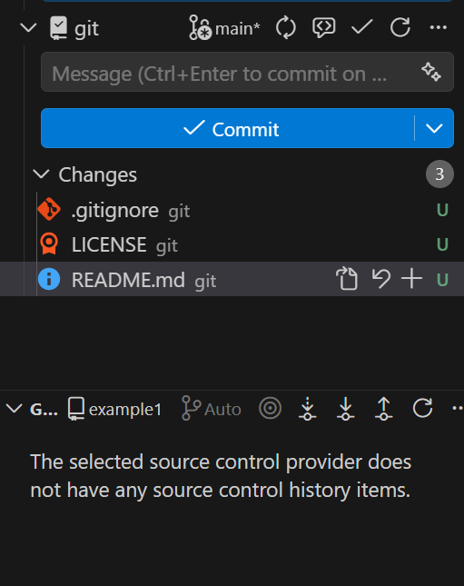
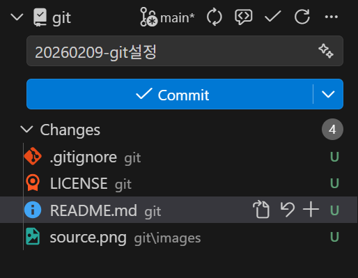

# VS Code + Git 연동 가이드

이 문서는 VS Code에서 Git을 설치하고, GitHub와 연동해 기본 작업(커밋/푸시/풀/브랜치)을 수행하는 방법을 정리합니다.

## 1) 준비물

- Git 설치: https://git-scm.com/
- VS Code 설치: https://code.visualstudio.com/

## 2) Git 설치 확인

PowerShell에서 아래 명령이 정상 동작하면 설치 완료입니다.

```powershell
git --version
```

## 3) VS Code에서 Git 인식 확인

VS Code를 열고, 우측 하단 또는 소스 제어(Source Control) 뷰에 Git이 감지되는지 확인합니다.
만약 Git을 못 찾는다면 VS Code를 재시작하거나, Git 설치 경로가 PATH에 등록되어 있는지 확인합니다.

이미지 필요: "소스 제어 뷰에 Git이 감지된 화면"


## 4) GitHub 로그인

VS Code에서 계정 로그인을 진행합니다.

- Command Palette 열기: `Ctrl+Shift+P`
- "GitHub: Sign in" 실행


## 5) 사용자 정보 설정

최초 1회만 설정하면 됩니다.

```powershell
git config --global user.name "Your Name"
git config --global user.email "you@example.com"
```

## 6) 저장소 연결(원격 추가)

로컬 폴더에서 원격 저장소를 연결합니다.

```powershell
git init
git remote add origin https://github.com/ubisam-heung/hello-git
git remote -v
```

이미 원격이 있다면 교체:

```powershell
git remote set-url origin https://github.com/ubisam-heung/hello-git
```

## 7) VS Code에서 기본 작업 흐름

1. 파일 수정
2. Source Control 뷰에서 변경 사항 확인
3. 메시지 입력 후 Commit
4. Push 또는 Sync




## 8) 브랜치 이름을 main으로 변경

```powershell
git branch -m master main
git push -u origin main
```

원격에 master가 남아있다면 삭제:

```powershell
git push origin --delete master
```

## 9) 자주 쓰는 명령

```powershell
git status
git add .
git commit -m "message"
git push
git pull
```

## 10) 문제 해결 체크리스트

- Git 설치 여부 확인: `git --version`
- VS Code 재시작
- 원격 주소 확인: `git remote -v`
- 인증 문제: VS Code에서 GitHub 재로그인

---
